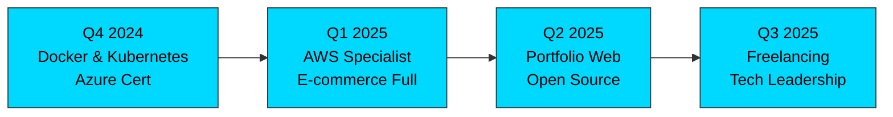

<!-- ENCABEZADO ANIMADO -->
<div align="center">
  
</div>

---

<!-- BADGES Y ESTADÍSTICAS -->
<div align="center">
  
  <a href="https://github.com/Jerzygroxx">
    
  </a>
  
  

</div>

---

## 👤 SOBRE MÍ

<div align="left">

```
📍 Ubicación:        Barranquilla, Colombia
🎓 Educación:        Ingeniería de Sistemas - CUC (8vo Semestre)
💼 Situación:        Estudiante | Buscando Oportunidades
🎯 Especialidad:     Desarrollo Web Full-Stack & Cloud Infrastructure
🚀 Misión:           Crear soluciones escalables que transformen negocios
🔥 Pasión:           Código limpio, arquitectura robusta e innovación
```

</div>

> *"No solo escribo código, construyo experiencias digitales que generan impacto real."*

---

## 🛠️ TECH STACK PROFESIONAL

<div align="center">

### 🌐 Frontend


### 🔧 Backend


### 🗄️ Bases de Datos


### ☁️ Cloud & DevOps


### 🛠️ Herramientas


</div>

---

## 📊 ESTADÍSTICAS GITHUB

<div align="center">


[](https://github.com/Jerzygroxx)

</div>

---

## 🎯 COMPETENCIAS TÉCNICAS

| Área | Competencia | Nivel |
|------|-------------|-------|
| **Desarrollo Web** | HTML5, CSS3, JavaScript ES6+ | ⭐⭐⭐⭐⭐ |
| **Backend** | Node.js, Express, APIs REST | ⭐⭐⭐⭐ |
| **Bases de Datos** | MySQL, PostgreSQL, MongoDB | ⭐⭐⭐⭐ |
| **DevOps** | Docker, GitHub Actions | ⭐⭐⭐⭐ |
| **Cloud** | Azure (Intermedio), AWS (Aprendizaje) | ⭐⭐⭐ |
| **Sistemas** | Linux, Redes, Infraestructura | ⭐⭐⭐ |
| **Soft Skills** | Liderazgo, Comunicación, Problemática | ⭐⭐⭐⭐⭐ |

---

## 📂 PROYECTOS DESTACADOS

<div align="center">

### ⭐ Portafolio de Trabajos

</div>

<table align="center">
  <tr>
    <td width="50%">
      <div align="center">
        <h3>🎓 CertTrack Pro</h3>
        <p><b>Sistema de Gestión de Certificaciones</b></p>
        
        
        <br/>
        <p>Plataforma completa para administración y tracking de certificaciones profesionales</p>
        <a href="https://github.com/Jerzygroxx/certtrack-pro-demo">
          
        </a>
      </div>
    </td>
    <td width="50%">
      <div align="center">
        <h3>📦 Sistema de Inventario</h3>
        <p><b>Gestión de Equipos Computacionales</b></p>
        
        
        <br/>
        <p>Aplicación empresarial con registro, actualización y reportes de inventario</p>
        <a href="https://github.com/Jerzygroxx/Inventario_Computo">
          
        </a>
      </div>
    </td>
  </tr>
  <tr>
    <td width="50%">
      <div align="center">
        <h3>🏗️ Construcción Digital</h3>
        <p><b>Plataforma Web Construcción Civil</b></p>
        
        
        <br/>
        <p>Solución de digitalización para modernizar la industria de construcción</p>
        <a href="https://github.com/Jerzygroxx/Proyecto-web2">
          
        </a>
      </div>
    </td>
    <td width="50%">
      <div align="center">
        <h3>🍽️ Gestión Restaurante</h3>
        <p><b>Sistema Integral ERP</b></p>
        
        
        <br/>
        <p>Solución completa: pedidos, inventario, facturación y reportes</p>
        <a href="https://github.com/Jerzygroxx/Restaurante_Jueves01">
          
        </a>
      </div>
    </td>
  </tr>
</table>

---

## 🚀 ACTUALMENTE HACIENDO

<div align="center">

| 🎯 | Actividad | Estado |
|:--:|-----------|--------|
| 🔍 | Explorando arquitecturas de microservicios | ⏳ En progreso |
| 📚 | Aprendiendo AWS y DevOps avanzado | ⏳ En progreso |
| 💻 | Desarrollando software de gestión empresarial | ⏳ En progreso |
| 🤝 | Buscando oportunidades en desarrollo web | ✅ Abierto |
| 🌐 | Profundizando en redes y sistemas | ⏳ En progreso |

</div>

---

## 📈 MI ROADMAP 2024-2025



---

## 🎓 ENFOQUE DE APRENDIZAJE

```
Desarrollo Web Full-Stack             ████████████████████ 90%
Gestión de Infraestructura           ████████████░░░░░░░░ 60%
Cloud Computing (Azure)              ███████████░░░░░░░░░ 55%
Docker & Containerización            ███████████░░░░░░░░░ 55%
Redes & Sistemas Operativos          █████████░░░░░░░░░░░ 45%
AWS & Cloud Services                 ███████░░░░░░░░░░░░░ 35%
Kubernetes & Orquestación            ██████░░░░░░░░░░░░░░ 30%
```

---

## 💬 ¿TRABAJEMOS JUNTOS?

<div align="center">

**Siempre abierto a:**

🤝 Proyectos desafiantes | 💡 Ideas innovadoras | 📖 Aprender juntos | 🚀 Open Source | 🎯 Colaboraciones

</div>

---

## 📬 CONECTEMOS

<div align="center">

[](https://linkedin.com/in/jorge-luis-perez-mendoza)
[](https://github.com/Jerzygroxx)
[](mailto:jorge.perez@example.com)
[](https://wa.me/573001234567)

</div>

---

<!-- FOOTER -->
<div align="center">
  <br/>
  
  <br/>
  <sub>⭐ Si te gusta mi trabajo, no dudes en dejar una estrella ⭐</sub>
</div>
